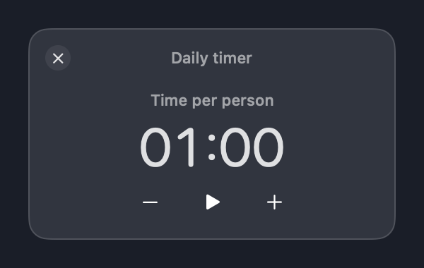
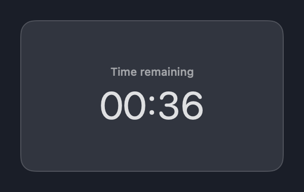
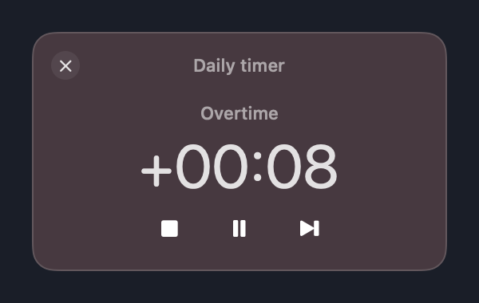
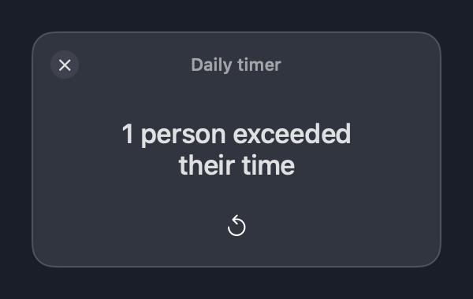

# Daily timer

[](https://github.com/awojasinski/daily-timer/actions/workflows/ci.yml)
[](https://github.com/awojasinski/daily-timer/releases/latest)

A small macOS timer for daily stand-ups. Set a time per person, keep the timer
beside your work, and move to the next speaker with one click. No accounts,
network requests, participant lists, or third-party runtime dependencies.

| Set the budget | Keep it beside your work |
| --- | --- |
|  |  |
| **Overtime** | **Meeting complete** |
|  |  |

*Renders of the actual SwiftUI views on a neutral backdrop. Live translucency
and Liquid Glass adapt to your desktop and system appearance.*

## Download

Get the ZIP for your Mac from [GitHub Releases](https://github.com/awojasinski/daily-timer/releases).
Unzip it and move **Daily timer.app** to Applications.

- **Apple Silicon:** choose the `arm64` archive.
- **Intel:** choose the `x86_64` archive.
- **macOS 14 or later.** Liquid Glass controls require macOS 26; earlier systems use native bordered controls.

Builds are ad-hoc signed, but not Developer ID signed or notarized. macOS may
require approval for the first launch. Each release includes SHA-256 checksums;
verify a downloaded ZIP beside its checksum file with:

```sh
shasum -a 256 -c daily-timer-<version>-macos-<architecture>.zip.sha256
```

## During a meeting

1. Click the timer to focus it. Hover to reveal the controls; Tab reveals them for keyboard navigation.
2. Use **− / +** to set the budget in 15-second steps, then press **Play**.
3. **Pause / Resume** handles interruptions. **Next** records the current person and starts the next immediately.
4. **Stop** records the final person and shows how many exceeded their time.
5. **New meeting** clears the result and returns to setup.

The timer stays centered when its title and controls fade away. Drag the window
background to move it. It floats above normal windows without covering
full-screen apps. Closing it hides it; use the menu-bar timer icon to show it
again, mute sounds, reset the meeting, or quit. Hiding does not pause timing.

| Time used | Appearance |
| --- | --- |
| Through 80% | No status tint |
| Above 80% through 95% | Yellow |
| Above 95% and below 105% | Orange |
| From 105% | Red |

Colors fade over 0.8 seconds. The final count includes only completed turns
**strictly above 105%**—exactly 105% is red but does not count as exceeded.
Each turn represents one person; the app does not track identities.

The macOS **Glass** sound plays once at the deadline, and **Pop** plays when
finishing a person. Both honor the menu-bar Sound setting. Space starts,
pauses, or resumes while the panel has keyboard focus; there are no global
shortcuts. Budget, sound, and window position persist. Session results do not
survive Quit. Pauses exclude elapsed time; system sleep does not.

## Build locally

Use Xcode 26.3 or later, or Swift 6 command-line tools with a complete macOS 26 SDK.

```sh
git clone https://github.com/awojasinski/daily-timer.git
cd daily-timer
bash scripts/test.sh
bash scripts/package.sh
open "dist/Daily timer.app"
```

The package script builds for the current machine, generates the app icon,
ad-hoc signs the app, and creates a ZIP plus checksum in `dist/`.
For an explicitly selected SDK:

```sh
bash scripts/test.sh --sdk /path/to/MacOSX26.sdk
SDKROOT=/path/to/MacOSX26.sdk bash scripts/package.sh
```

Regenerate the README renders from the app views:

```sh
bash scripts/render-previews.sh
```

## CI and releases

[CI and release](.github/workflows/ci.yml) runs on pull requests and pushes to
`main`. It checks workflow and release scripts, runs the Swift suite on Apple
Silicon/macOS 26 and Intel/macOS 15 with Xcode 26.3, then packages each tested
architecture. Both ZIPs remain available as workflow artifacts for 14 days.

A successful **push to `main`** automatically publishes a GitHub Release using
those same archives. Pull requests and manually dispatched runs never publish.
Publishing uses the built-in `GITHUB_TOKEN`; no Artifactory account or extra
release token is needed.

`VERSION` holds the release series, currently `1.0`. The workflow run number
becomes the patch version: run 42 produces `1.0.42` and tag `v1.0.42`. Local
builds default to `1.0.0`. Set `BUILD_NUMBER` to reproduce a release's version.
See [release maintenance](docs/releases.md) for setup, retries, and checks.

## Project layout

- `Sources/TimerCore`: deterministic timing, thresholds, and exceeded count.
- `Sources/DailyTimer`: SwiftUI views, AppKit panel, system sound, and preferences.
- `Tools/TimerAssets`: app icon generation.
- `Tests`: timer, sound dispatch, input-state regressions, and opt-in README renders.
- `scripts`: repeatable tests, packaging, rendering, and release publishing.

The bundle identifier remains stable across the rename to preserve preferences.
Earlier character artwork is retained as historical source material and is not
built into the app. The original stand-up timer idea was inspired by
[Daily Toast](https://dailytoast.io/); this is an independent app.

## License

[MIT](LICENSE).
